# **Traffic Sign Recognition** 

---

**Build a Traffic Sign Recognition Project**

The goals / steps of this project are the following:

* Load the data set 
* Explore, summarize and visualize the data set
* Design, train and test a model architecture
* Use the model to make predictions on new images
* Analyze the softmax probabilities of the new images
* Summarize the results with a written report

---
### Writeup / README

#### 1. Github - 

1. Here is a link to my [project code](https://github.com/amundada2310/CarND-Traffic-Sign-Classifier/blob/master/Traffic_Sign_Classifier.ipynb)

2. Here is my HTML LiNK : (file:///C:/Users/aishw/Downloads/Traffic_Sign_Classifier.html)

### Data Set Summary & Exploration

#### 1. Provide a basic summary of the data set. In the code, the analysis should be done using python, numpy and/or pandas methods rather than hardcoding results manually.

I used the pandas library to calculate summary statistics of the traffic
signs data set:

* The size of training set is 34799
* The size of the validation set is 4410
* The size of test set is 12630
* The shape of a traffic sign image is (32, 32, 3)
* The number of unique classes/labels in the data set is 43

#### 2. Include an exploratory visualization of the dataset.

There are total 43 different (unique) classes. Here is an exploratory visualization of the data set in training, validation and test data set:

1. Distribution of data-set in Traning set:

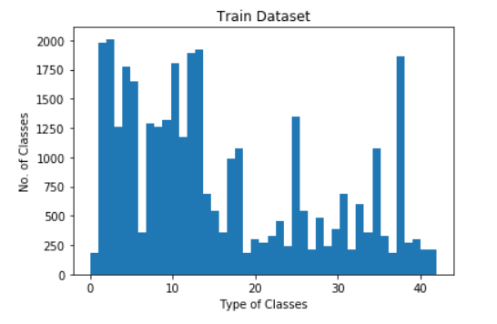

2. Distribution of data-set in Validation set:

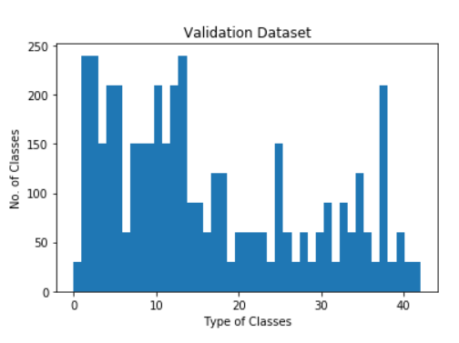

3. Distribution of data-set in Test set:

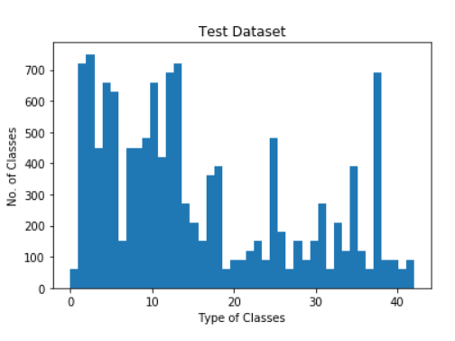

4. I partially visualized the training data set - 43 images:Below are a few of the visualized images

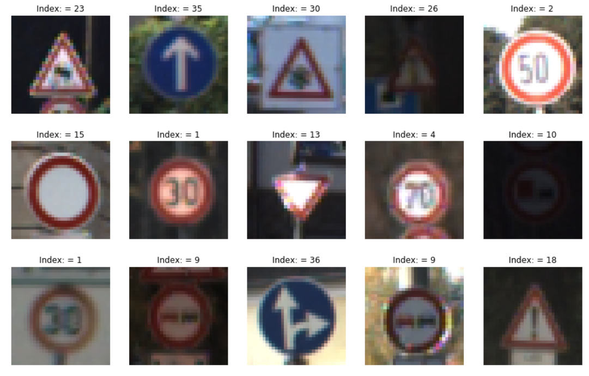

### Design and Test a Model Architecture

#### Step 1 - Preprocessing the Data Sets: 

1. I first converted the data to grayscale and then followed by normalizing the data. I used below code for doing the same. I even printed the shape of the image to make sure the image is normalized with resulting shape 32 x 32 x 1(channel).

`import matplotlib.pyplot as plt
import numpy as np

from skimage import data
from skimage.color import rgb2gray

def normalize_image(image_rgb):

    #image_gray = rgb2gray(image_rgb)
    image_gray = np.sum(image_rgb/3, axis=3, keepdims=True)
    image_normalize = (image_gray - 128) / 128
    return image_rgb, image_gray, image_normalize

X_train_original, X_train_grayscale, X_train_normalize = normalize_image(X_train)
X_validation_original, X_validation_grayscale, X_validation_normalize = normalize_image(X_validation)
X_test_original, X_test_grayscale, X_test_normalize = normalize_image(X_test)

print('X_train normalized image shape -', X_train_normalize.shape)
print('X_train grayscale image shape -', X_train_grayscale.shape)
print('X_train original image shape -', X_train_original.shape)

print('X_validation normalized image shape -', X_validation_normalize.shape)
print('X_validation grayscale image shape -', X_validation_grayscale.shape)
print('X_validation original image shape -', X_validation_original.shape)

print('X_test normalized image shape -', X_test_normalize.shape)
print('X_test validation image shape -', X_test_grayscale.shape)
print('X_test original image shape -', X_test_original.shape)`

2. I then visualized a few of the images to make sure the images are pre processed correctly.

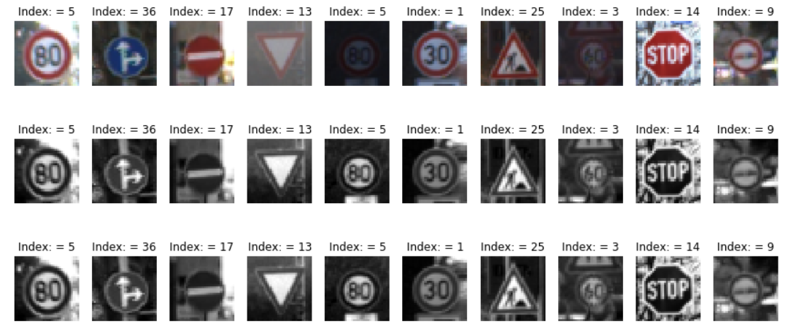

3. The Normalized data for each of the training, validation and test data set wasthen shuffled to vaoid any sort of biasing.

#### Step 2 - Model Architecture: 

1. Firstly, I initialized tensorflow and set the Epochs and Batch_size and set the learning rate as below:

` # Load Tensorflow
import tensorflow as tf 

#how many times the training data is ran through the network
EPOCHS = 65

#no. of batches in which each training set is divided. 
BATCH_SIZE = 128 

#learning rate tell tensorflow how quickly to update the weights 
rate = 0.00097 `

2. Secondly, The Model Architecture was created as below - Importnat thing to note here is the Outputlayer sizes were caluclated using the below formuale:

` Formula to use for calculating with VALID strides:
out_h = ((input_h - filter_h) + 1)/strides(h) and out_w = ((input_w - filter_w) + 1)/strides(w) `

''' Input

The Model architecture accepts a 32x32xC image as input, where C is the number of color channels. Images are normalized-grayscale, C is 1 in this case.

Architecture

Layer 1: Convolutional. The output shape should be 28x28x6.
Activation. Your choice of activation function.
Pooling. The output shape should be 14x14x6.

Layer 2: Convolutional. The output shape should be 10x10x16.
Activation. Your choice of activation function.
Pooling. The output shape should be 5x5x16.

Flatten. Flatten the output shape of the final pooling layer such that it's 1D instead of 3D. The easiest way to do is by using tf.contrib.layers.flatten, which is already imported for you.

Layer 3: Fully Connected. This should have 120 outputs.
Activation. Your choice of activation function.
Regularization. Your choice of probability to keep units (50%).

Layer 4: Fully Connected. This should have 84 outputs.
Activation. Your choice of activation function.
Regularization. Your choice of probability to keep units (50%).

Layer 5: Fully Connected (Logits). This should have 43 outputs.

Output
Return the result of the 2nd fully connected layer. '''

#### Step 3 : Training a Model

1. The Training Data set was used to train the model. Firstly, teh training set was divided into batch_size of 128 batches. The model was trained with each batch - which was 1 epochs. The Training was continued for 65 epochs.

2. After each Epochs, the accuracy of the moedl was evaluated on teh validation data set.

3. Below code for the same. It is important to note the trained model was saved, so that can be loaded/restored later.

` # Empty array for storing validation accuracy after each epoch run
validation_accuracy_epochs = []
loss_epochs = []

#set the session and initialize the variables
with tf.Session() as sess:
    sess.run(tf.global_variables_initializer())
    num_examples = len(X_train)
    
    print("Training...")
    print()
    
    #training over no. of epochs set before
    for i in range(EPOCHS):
        # shuffle the data matters while training - to make sure the training is not biased due to order of incoming images
        X_train, y_train = shuffle(X_train, y_train)
        # determine each batch and run each batch individually till entire data set is complete
        for offset in range(0, num_examples, BATCH_SIZE):
            end = offset + BATCH_SIZE
            batch_x, batch_y = X_train[offset:end], y_train[offset:end]
            _, loss = sess.run([training_operation, loss_operation], feed_dict={x: batch_x, y: batch_y, keep_prob: 0.5}) # note the dropout prob is set to 50%

         
        #evaluate the model by calling the function evaluate to calculate the accuracy    
        validation_accuracy = evaluate(X_validation, y_validation)
        validation_accuracy_epochs.append(validation_accuracy)
        loss_epochs.append(loss)
        print("EPOCH {} ...".format(i+1))
        print("Validation Accuracy = {:.3f}".format(validation_accuracy))
        print()
        
    # once the model is completely trained we save it
    # this is done so that we can load the data later and modify ot or evaluate the model on our test data set    
    saver.save(sess, './trained_model')
    print("Trained Model saved") 
`
    
#### Step 4: Trained Model

1. By using the above architecture the model was trained to have a accurarcy of 96.7%

2. Below figure shows how the selected hyperparameters helped to improve the validation accuracy:

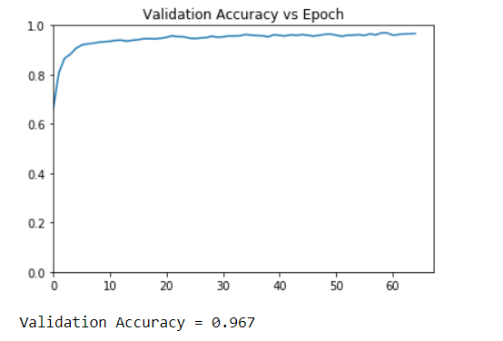

#### Step 5: Check the Trained Model on Test DataSet

1. The Model was restored and was used to determine accuracy of test data set. The Model was able to determine the data in Test Data set  with an accurary of 94.4% .

#### 1. 2. Describe what your final model architecture looks like including model type, layers, layer sizes, connectivity, etc.) Consider including a diagram and/or table describing the final model.

My final model consisted of the following layers:

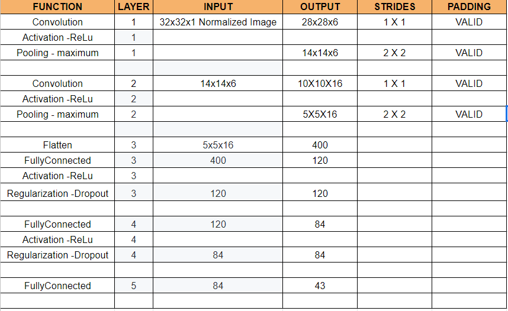

#### 3. Describe how you trained your model. The discussion can include the type of optimizer, the batch size, number of epochs and any hyperparameters such as learning rate.

Epochs = 65

Batch-Size = 128

Learning rate = 0.00097

Dropout probability = 50%

The cross entropy method was used compare logits with ground truth one encoded label values = 
`cross_entropy = tf.nn.softmax_cross_entropy_with_logits(labels=one_hot_y, logits=logits)`

The optimizer used to minimize the loss = `optimizer = tf.train.AdamOptimizer(learning_rate = rate)`

#### 4. Describe the approach taken for finding a solution and getting the validation set accuracy to be at least 0.93. Include in the discussion the results on the training, validation and test sets and where in the code these were calculated. Your approach may have been an iterative process, in which case, outline the steps you took to get to the final solution and why you chose those steps. Perhaps your solution involved an already well known implementation or architecture. In this case, discuss why you think the architecture is suitable for the current problem.

1. My final model results were:

* validation set accuracy of 96.7%
* test set accuracy of 94.4%

2. I played alot with the hyperparameters -
Epoch values varied from range 10 - 70
Batch-Size = 100/110/128
Learning rate = 0.001 - 0.0009
Dropout = 50 - 65%

The validtaion accurary was varrying between 95.1% - 96.67%

For example with Epoch 70, batch_size 128 and learning rate 0.001. I got 96.2% validation accurarcy.

3. Finally after varioud try and error, I selected the below values with 96.67% validation probability.

### Test a Model on New Images

#### 1. Choose five German traffic signs found on the web and provide them in the report. For each image, discuss what quality or qualities might be difficult to classify.

1. I chose the below 6 images to test my model:

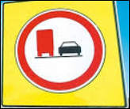

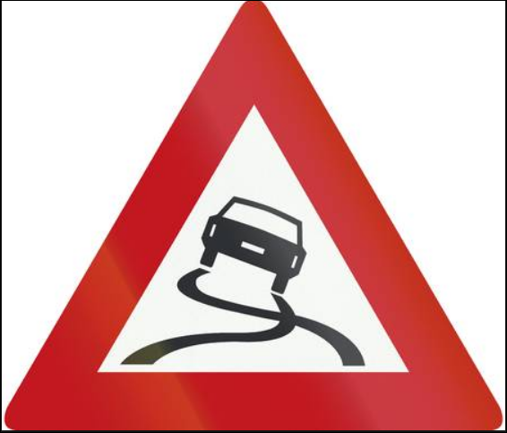

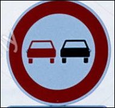

2. I found the above images to be difficult once we transform the image by pre-processing them into a 32x32x1 (normalized images). The images bet blurry and difficult to recognize.

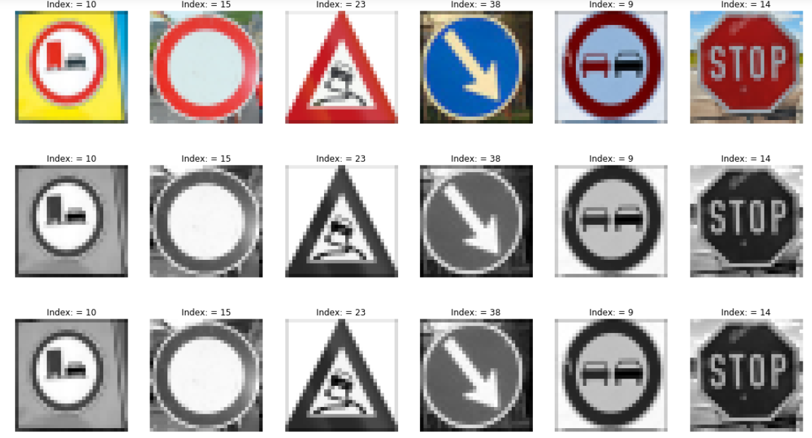

#### 2. Discuss the model's predictions on these new traffic signs and compare the results to predicting on the test set. At a minimum, discuss what the predictions were, the accuracy on these new predictions, and compare the accuracy to the accuracy on the test set (OPTIONAL: Discuss the results in more detail as described in the "Stand Out Suggestions" part of the rubric).

1. My model was able to predict all the signs with accuracy of 100%. This is better than the validation and the test accurary. I think the model can be made improved further by using augmentation technique and maybe trying 1x1 convolutions. 

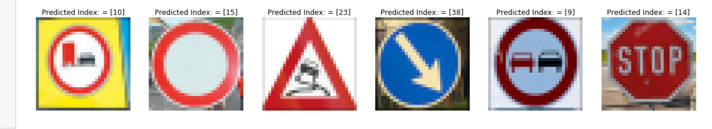

#### 3. Describe how certain the model is when predicting on each of the five new images by looking at the softmax probabilities for each prediction. Provide the top 5 softmax probabilities for each image along with the sign type of each probability. (OPTIONAL: as described in the "Stand Out Suggestions" part of the rubric, visualizations can also be provided such as bar charts)

1. Below code was used to run the softmax function and top-k function for determining top 5 guess and probabilities.

` softmax_logits = tf.nn.softmax(logits)
top_k = tf.nn.top_k(softmax_logits, k=5)

with tf.Session() as sess:
    sess.run(tf.global_variables_initializer())
    saver = tf.train.import_meta_graph('./trained_model.meta')
    saver.restore(sess, "./trained_model")
    test_softmax = sess.run(softmax_logits,feed_dict = {x: new_test_images_normalize,keep_prob: 1.0})
    test_top_k = sess.run(top_k, feed_dict={x: new_test_images_normalize,keep_prob: 1.0})
print(test_softmax)
print(test_top_k) `

2. The top 5 softmax probability were as below:

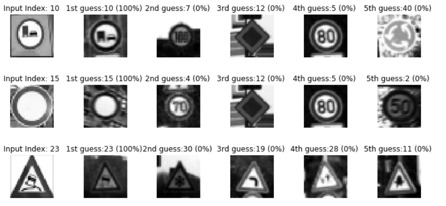
 
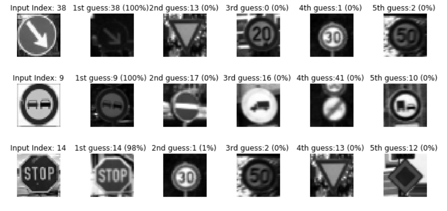 

### (Optional) Visualizing the Neural Network (See Step 4 of the Ipython notebook for more details)
#### 1. Discuss the visual output of your trained network's feature maps. What characteristics did the neural network use to make classifications?

Below are the result of feature map on conv1 layer. We can observe it from the maps how images are formed from detecting curves, edges to more complex objects and then the final image.

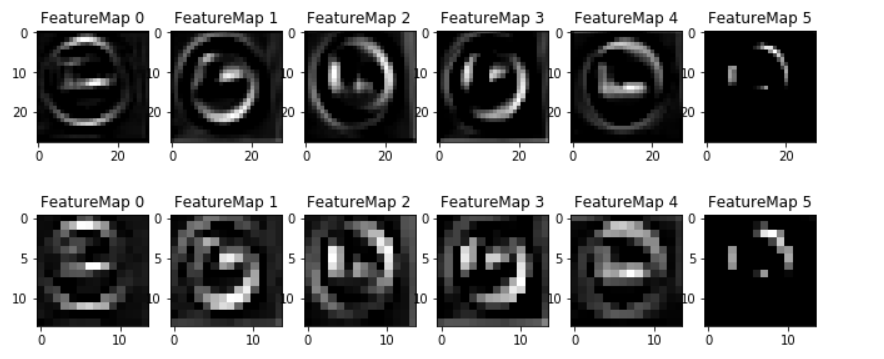 

